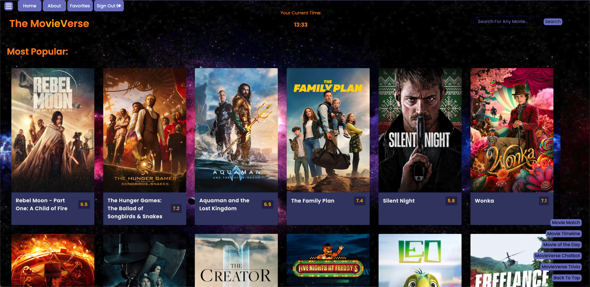

# The MovieVerse App

Welcome to The MovieVerse - your digital compass to the cinematic universe. Created by [Son Nguyen](https://github.com/hoangsonww) in 2023 and currently attracting more than **50,000 monthly users**, this application is designed to serve as a bridge connecting movie enthusiasts with an extensive collection of films across various genres and periods. Dive into an ocean of narratives, where stories come to life, right at your fingertips. This app is available at [https://movie-verse.com](https://movie-verse.com).

---

## Table of Contents

- [User Interface](#user-interface)
- [Introduction](#introduction)
- [Features & Usage](#features--usage)
- [Contributing](#contributing)
- [License](#license)
- [Contact](#contact)

## User Interface
<p align="center" style="cursor: pointer">
  <a href="https://movie-verse.com">
    
  </a>
</p>

## Introduction

The MovieVerse is an endeavor by Son Nguyen Hoang, crafted with the vision of creating a seamless and enriching experience for movie lovers. It's more than just a database; it's a portal to explore, discover, and immerse yourself in the art of cinema.

Through The MovieVerse, users can search for movies, view detailed information, rate, and review films, and interact with a community of like-minded movie enthusiasts. It's a platform that celebrates cinema in all its forms, from blockbuster hits to indie gems.

There is also a mobile version of The MovieVerse, which is developed using Apache Cordova. The mobile application is under review and will be available on the App Store and Google Play Store soon!

## Features & Usage

**Search & Discover:**

- **Search Functionality**: Find movies or TV shows by title, actor, director, or genre in our comprehensive database with ease.
- **Movie Details Page**: View detailed information, including synopses, cast, crew, ratings, and reviews.
- **Curated Lists**: Access collections of new releases, most popular, trending, genre-specific movies, and many more.

**Interactive Features:**
- **Interactive Database**: Rate movies, write reviews, and read opinions from other users.
- **Movie Watchlists**: Create and manage watchlists for different genres, time periods, or preferences. The watchlists are saved to your account for easy access on any device.
- **Movie Matching**: Discover movies that align with your preferences and ratings.

**Navigating The MovieVerse:**
- **MovieBot Chat**: Engage with our chatbot, MovieBot, for additional information about the application.
- **User Sign On**: Create an account for a personalized experience with additional features like saving watchlists.
- **Cinematic Timeline**: Explore cinema history by selecting specific time periods in the movie timeline.

**Enhanced User Experience:**
- **Responsive Design**: Enjoy a seamless experience on various devices and screen sizes.
- **Movie Recommendations**: Receive suggestions based on your movie preferences and reviews.
- **Statistics and Insights**: Access dynamically updating statistics for a tailored experience on both desktop and mobile.
- **Community Engagement**: Connect with other users, create your profile, share your thoughts, rate movies, and engage in discussions about your favorite movies.

**Mobile App & Accessibility:**
- **Mobile Application**: Experience The MovieVerse on the go with the mobile version (developed using Apache Cordova, coming soon to App Store and Google Play Store).
- **Accessibility Features**: Designed to be accessible to all users, including those with disabilities.

**Additional Information:**
- **Continuous Improvements**: The platform is ever-evolving with regular updates and new features.
- **Free & No Ads**: The MovieVerse is free to use and ad-free for an uninterrupted experience.

**And So Much More!**

## Project Structure

The MovieVerse is a full-stack application with a robust backend and a user-friendly frontend. The project is divided into the following **3 main** directories:
1. `MovieVerse-Backend`: The backend directory contains the server-side code, including the API, database, and server configuration.
2. `MovieVerse-Frontend`: The frontend directory contains the client-side code, including the user interface, user experience, and client configuration.
3. `MovieVerse-Mobile`: The mobile app directory contains the mobile application code, including the mobile user interface, user experience, and mobile client configuration.

There are also additional directories and files for project configuration, testing, and other utilities. The project is built using a variety of technologies, including `.github`, `utilities`, `project-config`, `MovieVerse-APIs`, `MovieVerse-Databases`, `MovieVerse-Middleware`, `images`, and more. Each directory serves a specific purpose in the development, deployment, and maintenance of The MovieVerse application.

## Technology Stack

| Frontend Technologies                                           | Backend Technologies                                            | Database Technologies                           | Mobile App Development                                            | Additional Technologies                                         |
|-----------------------------------------------------------------|-----------------------------------------------------------------|-------------------------------------------------|-------------------------------------------------------------------|-----------------------------------------------------------------|
| [React](https://reactjs.org/)                                   | [Node.js](https://nodejs.org/en/)                               | [MongoDB](https://www.mongodb.com/)             | [Apache Cordova](https://cordova.apache.org/)                     | [Webpack](https://webpack.js.org/)                              |
| [Vue](https://vuejs.org/)                                       | [Express](https://expressjs.com/)                               | [MySQL](https://www.mysql.com/)                 | [React Native](https://reactnative.dev/)                          | [Babel](https://babeljs.io/)                                    |
| [HTML5](https://html.com/)                                      | [Django](https://www.djangoproject.com/)                        | [Google Firebase](https://firebase.google.com/) | [Swift (for iOS development)](https://developer.apple.com/swift/) | [Docker](https://www.docker.com/)                               |
| [CSS3](https://www.w3.org/Style/CSS/Overview.en.html)           | [Django REST Framework](https://www.django-rest-framework.org/) |                                                 | [Kotlin (for Android)](https://kotlinlang.org/)                   | [Emscripten](https://emscripten.org/)                           |
| [JavaScript (Vanilla JS)](http://vanilla-js.com/)               | [Flask](https://flask.palletsprojects.com/en/1.1.x/)            |                                                 | [Java (for Android)](https://www.java.com/en/)                    | [WebAssembly](https://webassembly.org/)                         |
| [TypeScript](https://www.typescriptlang.org/)                   | [Python](https://www.python.org/)                               |                                                 |                                                                   | [Google Analytics](https://analytics.google.com/analytics/web/) |
| [FontAwesome Icons](https://react-icons.github.io/react-icons/) | [Ruby on Rails](https://rubyonrails.org/)                       |                                                 |                                                                   | [ESLint](https://eslint.org/)                                   |
| [SASS](https://sass-lang.com/)                                  | [C (Emscripten, WebAssembly)](https://emscripten.org/)          |                                                 |                                                                   | [Git](https://git-scm.com/)                                     |
| [Single Spa](https://single-spa.js.org/)                        | [JavaScript](https://www.javascript.com/)                       |                                                 |                                                                   | [The Movie Database](https://www.themoviedb.org/)               |


## Contributing

Contributions are what make the open-source community such an amazing place to learn, inspire, and create. Any contributions you make are **greatly appreciated**.

If you have a suggestion that would make this better, please fork the repo and create a pull request. You can also simply open an issue with the tag "enhancement".

1. Fork the Project
2. Create your Feature Branch (`git checkout -b feature/AmazingFeature`)
3. Install Emscripten and compile the C code to WebAssembly (refer to the README.md file in `utilities` directory [here](../utilities/README.md).)
4. Take a look at the project configuration directory (project-config) and make sure that the paths are correct.
5. Visit the backend directory and install the dependencies (if any):
    ```
    npm install
    ```
6. Start the backend server:
    ```
    npm start
    ```
7. Visit the frontend directory (root) and install the dependencies (if any):
    ```
    npm install
    ```
8. Start the frontend server:
    ```
    npm start
    ```
9. Visit the mobile app directory and install the dependencies (if any):
    ```
    npm install
    ```
10. Start the mobile app server:
    ```
    npm start
    ```
11. Commit your Changes (`git commit -m 'Add some AmazingFeature'`)
12. Push to the Branch (`git push origin feature/AmazingFeature`)
13. Open a Pull Request (if you want to merge your changes to our official app)
14. Enjoy coding and let me know if you have any questions!

## Privacy Policy

The MovieVerse is committed to protecting your privacy. Our Privacy Policy page explains how your personal information is collected, used, and disclosed by The MovieVerse.  Feel free to visit our [Privacy Policy](https://movie-verse.com/src/html/privacy-policy) page to learn more.

## Terms of Service

By accessing or using The MovieVerse, you agree to be bound by our [Terms of Service](https://movie-verse.com/src/html/terms-of-service).

## License

Distributed under the MIT License. See [LICENSE](LICENSE) for more information.

## Code of Conduct

The MovieVerse is committed to fostering a welcoming community. Please refer to our [Code of Conduct](CODE_OF_CONDUCT.md) for more information.

## Security Policy

The MovieVerse is committed to ensuring the security of the platform. Please refer to our [Security Policy](SECURITY.md) for more information.

## Contact

Son Nguyen Hoang - [@hoangsonww](https://github.com/hoangsonww)

Website: [https://movie-verse.com](https://movie-verse.com)

Email: [Official MovieVerse Email](mailto:info@movie-verse.com)

---

Please also note that the **MovieVerse** is an ever-evolving platform, and more updates are underway. I am continually enhancing the user experience and adding new features to help you navigate the vast sea of cinema with ease and excitement! Also, special thanks to [The Movie Database (TMDb)](https://www.themoviedb.org/) for providing additional movie data that greatly enriches The MovieVerse experience!
