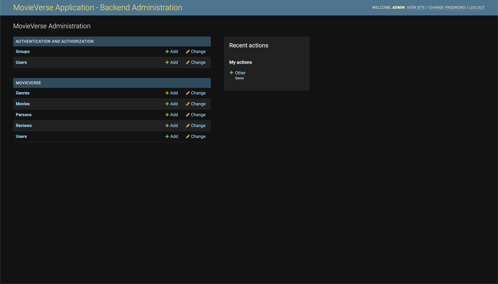

# The MovieVerse - `MovieVerse-Backend` Directory

## Table of Contents
- [Overview](#overview)
- [Architecture](#architecture)
- [Data Flow Illustration](#data-flow-illustration)
- [Getting Started](#getting-started)
  - [Prerequisites](#prerequisites)
  - [Installation](#installation)
  - [Quick Start](#quick-start)
  - [Running the Services (Recommended)](#running-the-individual-services-recommended)
    - [Database Services](#database-services)
    - [Django Service](#django-service)
    - [API Service](#api-service)
    - [Machine Learning Services](#machine-learning-services)
    - [Crawler Service](#crawler-service)
- [Contributing](#contributing)
- [License](#license)

## Overview

The backend of MovieVerse is built using the **microservices architecture**. This architecture allows for independent scalability and enhanced flexibility in the development of different functionalities of the app, such as authentication, user management, movie data processing, and more.

**Important**: Be sure to carefully read this file and the [README.md](databases/README.md) file in the `databases` directory for more information on the backend services of MovieVerse before you start developing.

## Production Microservices Stack

MovieVerse now ships a full production-grade microservices implementation under `MovieVerse-Backend/services/` with the following services:

- **Auth Service** (`/register`, `/login`, `/refresh`) with JWT + Redis-backed refresh tokens
- **User Service** for profile management and preferences
- **Movie Service** for movie metadata and catalog updates
- **Review Service** for ratings/reviews with Kafka + RabbitMQ events
- **Search Service** backed by OpenSearch for text search
- **Search Indexer Service** for Kafka-driven indexing and reindex jobs
- **Notification Service** for user notifications and queue consumers
- **Recommendation Service** that integrates with `MovieVerse-AI`
- **Metadata Service** for people/genre catalogs and analysis payloads
- **Crawler Service** + worker for ingesting external sources
- **Data Platform Service** for TMDB ingestion and database health

These services are built with FastAPI, SQLAlchemy, Redis, Kafka, RabbitMQ, and OpenSearch. They are ready to deploy via the root `docker-compose.microservices.yml`, Kubernetes manifests, or AWS stacks.

## Live Backend Services

Deployed environments expose the Nginx edge gateway plus service-level documentation. Use your deployment base URL and route through the gateway (for example: `/movies`, `/reviews`, `/search`).

## Architecture

The microservices architecture of MovieVerse is designed to segregate the application into small, loosely coupled services. Each service is focused on a single business capability and can be developed, deployed, and scaled independently.

- **Nginx Edge**: Load-balanced gateway and routing layer for all services.
- **Django BFF**: Server-rendered UX and aggregation for microservice calls.
- **Authentication Service**: Manages user authentication and authorization.
- **User Service**: Handles user-related operations like profile management.
- **Movie Service**: Manages movie data and interactions.
- **MovieVerse-AI**: Dedicated ML platform for recommendations, embeddings, and NLP/vision.
- **Crawler Service**: Dynamically updates the database with new movie data from various online sources.
- **Metadata Service**: Stores genres, people, and enrichment metadata in MongoDB.
- **Search Indexer Service**: Consumes Kafka events to keep OpenSearch current.
- **Data Platform Service**: Centralized ingestion and health checks for data sources.
- **Review Service**: Handles user reviews and ratings.
- **Recommendation Service**: Provides movie recommendations to users based on their preferences and viewing history.
- **Search Service**: Offers comprehensive search functionality for movies and users.
- **Observability**: Prometheus/Grafana/Jaeger + ELK for metrics, traces, and logs.

## Data Flow Illustration

Here is an illustration of the data flow in the backend services of MovieVerse:


For more information on the data flow in the backend services of MovieVerse, refer to the code and the [README.md](databases/README.md) file in the `databases` directory.

## Getting Started

### Prerequisites

- Node.js
- Docker
- Docker Compose
- Python 3.11+
- MongoDB
- MySQL
- PostgreSQL
- Kafka
- Redis
- Django (gateway)
- RabbitMQ
- Nginx
- OpenSearch
- Elasticsearch/Logstash/Kibana (ELK)
- Flake8 for Python linting
- BeautifulSoup4 and httpx for web scraping in the Crawler Service
- Transformers and PyTorch for AI functionalities within MovieVerse-AI

To satisfy these prerequisites, simply run the following command:

```bash
pip install -r requirements.txt
```

### Installation

1. Clone the repository: 
    ```bash
    git clone https://github.com/hoangsonww/The-MovieVerse-Database.git
    ```
   
2. Navigate to the repository: 
   ```bash
   cd MovieVerse-Backend
   ```
   
3. Create a Virtual Environment (optional but recommended):
    ```bash
    python3 -m venv venv
    source venv/bin/activate
    ```
   
4. Follow the specific installation instructions for each service below.

### Quick Start

To start the production-ready microservices stack locally:

```bash
docker compose -f ../docker-compose.microservices.yml up -d
```

This brings up the Nginx gateway plus Kafka, RabbitMQ, Redis, Postgres, MySQL, OpenSearch, MongoDB, and the AI API.

**Important**: Configure `DJANGO_SECRET_KEY` and `DJANGO_DEBUG` via environment variables before running the Django gateway. See [settings.py](django_backend/django_backend/settings.py) for defaults and overrides.

### Backend Configuration

- Django gateway: `DJANGO_DEBUG` defaults to `false`; set `DJANGO_SECRET_KEY` when `DJANGO_DEBUG=false`.
- Django database: `DJANGO_DB_ENGINE` + `DJANGO_DB_NAME`, with `DJANGO_DB_USER`, `DJANGO_DB_PASSWORD`, `DJANGO_DB_HOST`, `DJANGO_DB_PORT`, `DJANGO_DB_CONN_MAX_AGE` for production DBs.
- Microservices runtime: `MOVIEVERSE_ENVIRONMENT=production` enables strict validation; `MOVIEVERSE_AUTO_MIGRATE=false` is required in production.
- Microservices SQL pools: `MOVIEVERSE_DB_POOL_SIZE`, `MOVIEVERSE_DB_MAX_OVERFLOW`, `MOVIEVERSE_DB_POOL_RECYCLE_SECONDS`.
- Seeding controls: `MOVIEVERSE_ALLOW_SEEDING=true` + `MOVIEVERSE_SEED_TOKEN` for controlled bootstrap endpoints.
- RabbitMQ routing: `MOVIEVERSE_RABBITMQ_EVENTS_QUEUE`, `MOVIEVERSE_RABBITMQ_NOTIFICATIONS_QUEUE`.

### Microservices Quick Start (Production Stack)

To run the full microservices stack locally with Kafka, RabbitMQ, Redis, Postgres, MySQL, OpenSearch, and the AI API:

```bash
docker compose -f ../docker-compose.microservices.yml up -d
```

Service endpoints are routed through the Nginx edge at `http://localhost:8080/`.

### Observability (Prometheus + Grafana + Jaeger + ELK)

To enable metrics, traces, and centralized logging:

```bash
docker compose -f ../docker-compose.microservices.yml -f ../docker-compose.observability.yml up -d
```

- Kibana: `http://localhost:5601`
- Prometheus: `http://localhost:9090`
- Grafana: `http://localhost:3000`
- Jaeger: `http://localhost:16686`

### Running the Individual Services (Recommended)

To run the MovieVerse's backend services, follow these steps **in order**:

#### Database Services

MovieVerse currently uses MongoDB, Redis, PostgreSQL, and MySQL as its primary databases, as well as RabbitMQ as its primary message broker. To run these databases, execute the following commands:

1. Ensure that MongoDB, Redis, RabbitMQ, PostgreSQL, and MySQL are installed on your machine and are running. For example, on MacOS and if you are using `Homebrew`, you can run the following commands:

    ```bash
    brew services start mongodb
    brew services start rabbitmq
    brew services start mysql
    brew services start postgresql
    redis-server
    ```
    Also, before you continue, ensure that the MySQL database `MovieVerse` is running and exists. If not, open the MySQL client using the following command:

    ```bash
    mysql -u root -p
    ```
   
    Then, enter your password and run the following command to create the database:

    ```sql
    CREATE DATABASE MovieVerse;
    LIST DATABASES;
    ```
   
    You should see the `MovieVerse` database in the list of databases.

    Also, for your PostgreSQL database, ensure that the database `MovieVerse` is running and exists. If not, open the PostgreSQL client using the following command:

    ```bash
    psql -U root -d <your_database_name>
    ```
   
    Replace `<your_database_name>` with the name of your database - the one you created when you installed PostgreSQL.
   
    Then, run the following command to create the database:

    ```sql
    CREATE DATABASE MovieVerse;
    ```
   
2. Run the Python utilities inside the `databases` directory to verify connectivity:

    ```bash
    python -m databases.app
    ```
   
3. If the script runs successfully, you should see the following output in your terminal:

    ```bash
    Server running on port 9090
    Visit http://localhost:9090/ to test the connection.
    Connected to MongoDB database 1: MovieVerse
    Connected to MongoDB database 2: MovieVerse_movies
    Connected to MongoDB database 3: MovieVerse_users
    Connected to MongoDB database 4: MovieVerse_reviews
    Connected to MongoDB database 5: MovieVerse_people
    Connected to MongoDB database 6: MovieVerse_genres
    Redis Connected
    Connected to PostgreSQL
    Connected to MySQL
    Redis Test: Hello from Redis
    PostgreSQL Test: 2024-06-18T16:53:56.494Z
    RabbitMQ Connected
    [*] Waiting for messages in task_queue. To exit press CTRL+C
    ```
   
    This output confirms that you have successfully connected to all the databases required for the backend services of MovieVerse. Now you can start developing and testing the services!
   
4. Test the RabbitMQ functionality by sending a message to the queue:

    ```bash
    python -m databases.publish --message "Hello from MovieVerse"
    ```
   
5. If the message is successfully sent, you should see the following output in your terminal:

    ```bash
    [x] Received Hello from RabbitMQ
    ```
   
6. You can also go to `http://localhost:9090/` in your browser to test the connection to the databases. If the connection is successful, you should see the following output:

    ```
    Congratulations! MovieVerse server is running! MongoDB, MySQL, PostgreSQL, and Redis connections have been established.
    ```

    This confirms that you have successfully connected to all the databases required for the backend services of MovieVerse.

7. For the next steps, refer to the [README.md](databases/README.md) file in the `databases` directory for more information on the database services.
   
**Disclaimer**: These servers are for your local development environment only, in order for you to see how our backend services interact with each other.
In our production environment, we use cloud-based services like AWS, Azure, and Google Cloud (in our case, **Heroku**) to host our databases and services. This thus will look different from what you might see on your end.
   
#### Django Service

The Django service is responsible for handling the majority of backend functionalities of MovieVerse, such as API endpoints, movies management, database interactions, user management, and more. It was designed using the **Model-View-Controller (MVC)** architecture. To run the Django service, follow these steps:

1. Navigate to the `django_backend` directory:
    ```bash
    cd django_backend
    ```
   
2. Apply Django migrations (auth/session tables only):
    ```bash
    python manage.py migrate
    ```
   
3. Run the Django gateway:
    ```bash
    python manage.py runserver
    ```
NOTE: Configure `DJANGO_SECRET_KEY` and `DJANGO_DEBUG` in the environment before running the gateway.

If your installation and run are successful, you should see the following output in your terminal:

```bash
Watching for file changes with StatReloader
Performing system checks...

System check identified no issues (0 silenced).
June 17, 2024 - 08:31:47
Django version 3.2, using settings 'django_backend.settings'
Starting development server at http://127.0.0.1:8000/
Quit the server with CONTROL-C.
[17/Jun/2024 08:39:00] "GET /search/?search=g HTTP/1.1" 200 2693
```

If you go to `http://127.0.0.1:8000/admin/` in your browser, you should see the following admin interface for the backend of MovieVerse:

<p align="center" style="cursor: pointer">
    
</p>

This is the Django admin interface for the gateway. Domain data is owned by microservices; the admin primarily manages Django auth and gateway settings.

For example, if you click on `Movies`, you should see the following interface, which allows you to manage movies in the database:

<p align="center" style="cursor: pointer">
    
</p>

Note that the UI that you see when you go to `http://127.0.0.1:8000/` in your browser is only a template and does not represent the actual UI of the MovieVerse app. The actual UI is built using React and Vue and can be found in the [MovieVerse-Frontend](../MovieVerse-Frontend) directory.

**Important**: There has been a known Django bug where the admin interface' CSS styles are not loaded properly. If you encounter this issue, you can fix it by:

1. Set the `STATIC_ROOT` variable in the `settings.py` file to the path of the `static` directory in the `django_backend` directory:

    ```python
    import os
    
    STATIC_ROOT = os.path.join(BASE_DIR, 'static')
    ```

2. Set the `STATIC_URL` variable in the `settings.py` file to the path of the `static` directory in the `django_backend` directory:

    ```python
    STATIC_URL = '/static/'
    ```
   
3. Run the following command to collect the static files:

    ```bash
    python manage.py collectstatic
    ```

If the issue is still not fixed, contact me at [info@movie-verse.com](mailto:info@movie-verse.com) so that I can take a look at your situation.

#### API Service

The API service is responsible for handling API requests from the frontend of MovieVerse. To get started with the API service, follow the steps outlined in this [README.md](databases/README.md#rest-apis) file.

#### Edge Gateway (Nginx)

The edge gateway routes traffic to microservices with production-grade load balancing. Use the Nginx container from `docker-compose.microservices.yml` or deploy via `kubernetes/edge/nginx.yml`.

#### Machine Learning Services

MovieVerse AI/ML lives in `MovieVerse-AI/` and is deployed as the `ai-api` service. See `MovieVerse-AI/README.md` for training pipelines, model serving, and feature store workflows.

#### Crawler Service

The crawler runs as `crawler-service` + `crawler-worker` and uses RabbitMQ for job orchestration. Use the microservices compose stack or the Kubernetes manifests to deploy it.

## Contributing

Contributions are what make the open-source community such an amazing place to learn, inspire, and create. Any contributions you make are **greatly appreciated**.

## License

Distributed under the CC BY-NC 4.0 License. See `LICENSE` for more information.

---
