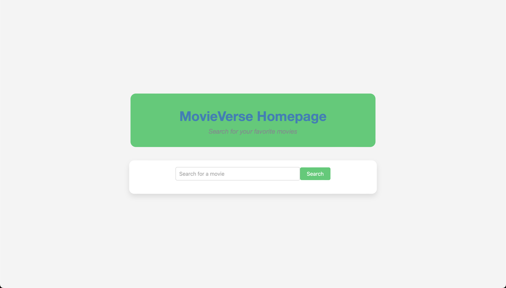

# The MovieVerse - `MovieVerse-Backend` Directory

---

## Table of Contents
- [Overview](#overview)
- [Architecture](#architecture)
- [Getting Started](#getting-started)
  - [Prerequisites](#prerequisites)
  - [Installation](#installation)
  - [Running the Services](#running-the-services)
    - [Crawler Service](#crawler-service)
    - [Flask Service](#flask-service)
    - [Django Service](#django-service)
    - [Machine Learning Service](#machine-learning-service)
- [Contributing](#contributing)
- [License](#license)

## Overview

The backend of MovieVerse is built using a microservices architecture. This architecture allows for independent scalability and enhanced flexibility in the development of different functionalities of the app, such as authentication, user management, movie data processing, and more.

## Architecture

The microservices architecture of MovieVerse is designed to segregate the application into small, loosely coupled services. Each service is focused on a single business capability and can be developed, deployed, and scaled independently.

- **Authentication Service**: Manages user authentication and authorization.
- **User Service**: Handles user-related operations like profile management.
- **Movie Service**: Manages movie data and interactions.
- **Machine Learning Service**: Provides AI functionalities for movie data processing.
- **Crawler Service**: Dynamically updates the database with new movie data from various online sources.
- **Review Service**: Handles user reviews and ratings.
- **Recommendation Service**: Provides movie recommendations to users based on their preferences and viewing history.
- **Search Service**: Offers comprehensive search functionality for movies and users.
- **And so many more...**

## Getting Started

### Prerequisites

- Node.js
- Docker
- Docker Compose
- Express.js
- MongoDB
- MySQL
- PostgreSQL
- Flask
- Django
- Flake8 for Python linting
- Celery for asynchronous task queue
- Redis or RabbitMQ as a broker for Celery
- BeautifulSoup4 and Requests for web scraping in the Crawler Service
- Transformers and PyTorch for AI functionalities within the Crawler Service
- Python 3.8 or higher (and an IDE that supports Python and can run Python scripts)

To satisfy these prerequisites, simply run the following command:

```bash
pip install -r requirements.txt
```

### Installation

1. Clone the repository: 
    ```bash
    git clone https://github.com/hoangsonww/The-MovieVerse-Database.git
    ```
2. Navigate to the repository: 
   ```bash
   cd mobile-backend
   ```
3. Create a Virtual Environment (optional but recommended):
    ```bash
    python3 -m venv venv
    source venv/bin/activate
    ```
4. Follow the specific installation instructions for each service below.

### Running the Services

#### Crawler Service

1. Navigate to the `crawler` directory:
    ```bash
    cd crawler
    ```
2. Run the Crawler Service:
    ```bash
    python main.py
    ```

Note: For security reasons, we have disabled the file `main.py` as it contains sensitive information. Please [contact me](mailto:info@movie-verse.com) for access to the full code.

#### Flask Service

1. Navigate to the `flask_backend` directory:
    ```bash
    cd flask_backend
    ```
   
2. Run the Flask Service:
    ```bash
    python flask.py
    ```
   
#### Django Service

1. Navigate to the `django_backend` directory:
    ```bash
    cd django_backend
    ```
   
2. Make the necessary migrations:
    ```bash
    python manage.py makemigrations
    python manage.py migrate
    ```
   
3. Run the Django Service:
    ```bash
    python manage.py runserver
    ```
NOTE: Before running the Django server, be sure to set the `DEBUG` variable to `True` in the `settings.py` file. This is crucial for running the server locally. Additionally, you are also required to obtain a Django secret key and set it in the `settings.py` file. For security reasons, we have hidden the secret key in the `.env` file. Please [contact me](mailto:info@movie-verse.com) for access to the secret key.

```python
SECRET_KEY = 'your_secret_key'
Debug = True
```

If your installation and run are successful, you should see the following output in your terminal:

```bash
Watching for file changes with StatReloader
Performing system checks...

System check identified no issues (0 silenced).
June 17, 2024 - 08:31:47
Django version 3.2, using settings 'django_backend.settings'
Starting development server at http://127.0.0.1:8000/
Quit the server with CONTROL-C.
[17/Jun/2024 08:39:00] "GET /search/?search=g HTTP/1.1" 200 2693
```

If you go to `http://127.0.0.1:8000/` in your browser, you should see te following TEMPLATE for the backend of MovieVerse:

<p align="center" style="cursor: pointer">
    
</p>

This is the Django admin interface for the backend of MovieVerse. It allows you to manage users, movies, reviews, and more.

<p align="center" style="cursor: pointer">
    
</p>

Note that these are only templates and do not represent the actual UI of the MovieVerse app. The actual UI is built using React and Vue and can be found in the [MovieVerse-Frontend](../MovieVerse-Frontend) directory.

#### Database Services

MovieVerse currently uses MongoDB, Redis, PostgreSQL, and MySQL as its primary databases. To run these databases, execute the following commands:

1. Ensure that MongoDB, Redis, RabbitMQ, PostgreSQL, and MySQL are installed on your machine and are running. For example, on MacOS and if you are using `Homebrew`, you can run the following commands:

    ```bash
    brew services start mongodb
    brew services start rabbitmq
    brew services start mysql
    brew services start postgresql
    redis-server
    ```
    Also, before you continue, ensure that the MySQL database `MovieVerse` is running and exists. If not, open the MySQL client using the following command:

    ```bash
    mysql -u root -p
    ```
   
    Then, enter your password and run the following command to create the database:

    ```sql
    CREATE DATABASE MovieVerse;
    LIST DATABASES;
    ```
   
    You should see the `MovieVerse` database in the list of databases.

    Also, for your PostgreSQL database, ensure that the database `MovieVerse` is running and exists. If not, open the PostgreSQL client using the following command:

    ```bash
    psql -U root -d <your_database_name>
    ```
   
    Replace `<your_database_name>` with the name of your database - the one you created when you installed PostgreSQL.
   
    Then, run the following command to create the database:

    ```sql
    CREATE DATABASE MovieVerse;
    ```
   
2. Run the scripts inside the `databases` directory to create the necessary databases and tables:

    ```bash
    cd databases
    node app.js
    ```
   
3. If the script runs successfully, you should see the following output in your terminal:

    ```bash
    node app.js
    Server running on port 9090
    Visit http://localhost:9090/ to test the connection.
    Redis Connected
    Connected to MySQL
    Redis Test: Hello from Redis
    Connected to PostgreSQL
    PostgreSQL Test: 2024-06-18T16:25:52.361Z
    RabbitMQ Connected
    [*] Waiting for messages in task_queue. To exit press CTRL+C
    Connected to MongoDB
    ```
   
4. Test the RabbitMQ functionality by sending a message to the queue:

    ```bash
    node publish.js
    ```
   
5. If the message is successfully sent, you should see the following output in your terminal:

    ```bash
    [x] Received Hello from RabbitMQ
    ```
   
Note that these servers are for your local development environment only, in order for you to see how our backend services interact with each other.

In our production environment, we use cloud-based services like AWS, Azure, and Google Cloud to host our databases and services. This thus will look different from what you might see on your end.

#### Machine Learning Services

This service contains several utilities for processing movie data using AI functionalities. To run each sub-service within `machine-learning`, follow the specific instructions provided in the respective directory.

For more details about running these sub-services, go to the [Machine Learning Service Directory](machine-learning/README.md).

## Contributing

Contributions are what make the open-source community such an amazing place to learn, inspire, and create. Any contributions you make are **greatly appreciated**.

## License

Distributed under the MIT License. See `LICENSE` for more information.

---
