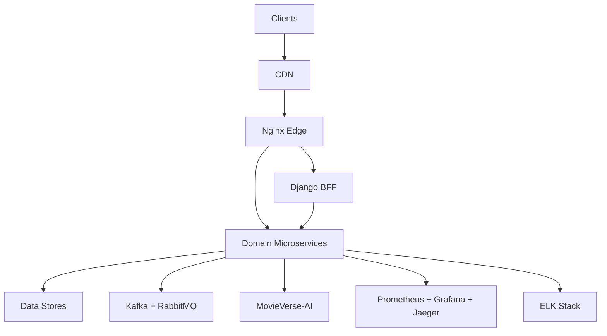
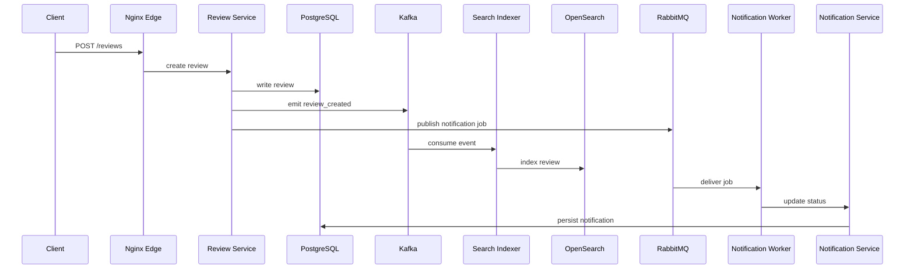

# MovieVerse System Design

## Executive Summary

MovieVerse is a cloud-native, event-driven microservices platform for movie discovery, personalization, and community engagement. The architecture prioritizes independent deployability, horizontal scalability, and operational resilience. It consists of an API edge layer, domain microservices, an AI platform, and a shared observability and deployment stack.

## Design Goals

- Independent deployability and scaling per service
- Event-driven workflows for recommendations, notifications, and analytics
- Production-grade security and zero-downtime deployments
- Clear separation of data ownership per service
- Observability by default (metrics, logs, traces)

## High-Level Architecture



The Django BFF provides server-rendered pages and aggregation over microservices while the Nginx edge handles load balancing and routing.

## Core Microservices

### Auth Service
- Handles registration, login, and JWT issuance
- Stores users in PostgreSQL
- Refresh tokens stored in Redis with TTL
- Exposes `/register`, `/login`, `/refresh`

### User Service
- Owns user profile data and preferences
- PostgreSQL schema isolated from Auth
- Provides `/profiles` CRUD APIs

### Movie Service
- Owns movie catalog metadata
- Uses MySQL for transactional storage
- Emits `movie_created` and `movie_updated` Kafka events

### Review Service
- Stores ratings and reviews (PostgreSQL)
- Emits `review_created` Kafka events
- Publishes notifications to RabbitMQ

### Search Service
- OpenSearch-backed indexing and full-text search
- Provides `/search` and `/index` APIs

### Search Indexer Service
- Consumes Kafka events to keep OpenSearch current
- Exposes `/reindex/movies` and `/reindex/reviews` for bulk rebuilds

### Metadata Service
- MongoDB-backed catalog for genres, people, and AI enrichment metadata
- Provides `/genres`, `/people`, and `/movies/{movie_id}/analysis` APIs

### Crawler Service
- Orchestrates external crawling via RabbitMQ queue
- Worker enriches data with AI sentiment/summaries and stores via services

### Data Platform Service
- Handles TMDB ingestion, controlled seeding, and health checks
- Central entry point for data operations in production

### Notification Service
- Stores notifications in PostgreSQL
- Receives RabbitMQ jobs for dispatch
- Consumer updates delivery status

### Recommendation Service
- Integrates with MovieVerse-AI for personalization
- Uses Redis for caching
- Falls back to popular content when AI is unavailable

## Eventing and Messaging

- **Kafka**: high-throughput event stream for analytics and AI feature generation
- **RabbitMQ**: reliable task queues for notifications and async workflows

Event schema (example):

```
{
  "type": "review_created",
  "review_id": 123,
  "user_id": 42,
  "movie_id": 8,
  "rating": 4.5
}
```



## Data Layer

| Service | Primary Store | Purpose |
| --- | --- | --- |
| Auth | PostgreSQL | Identity + credentials |
| User | PostgreSQL | Profile data |
| Movie | MySQL | Movie catalog |
| Review | PostgreSQL | Ratings + reviews |
| Search | OpenSearch | Search index |
| Search Indexer | OpenSearch | Index rebuilds |
| Metadata | MongoDB | Genres, people, enrichment |
| Data Platform | Multi-store | Ingestion + seed orchestration |
| Notification | PostgreSQL | Message state |
| Recommendation | Redis | Cached recs |

## AI/ML Platform (MovieVerse-AI)

The AI platform is a standalone production system with training, feature store, and online inference.

- **Feature Store**: Feast (Postgres offline, Redis online)
- **Model Registry**: MLflow + S3/MinIO artifacts
- **Pipelines**: batch training and embedding creation
- **Inference**: FastAPI service with metrics

Supported capabilities:
- Collaborative filtering recommendations (LightFM)
- Content-based similarity (SentenceTransformers + FAISS)
- Sentiment classification for reviews
- Ranking models for feeds
- Drift detection via statistical monitoring

## Edge Layer

Nginx provides:
- Load balancing
- Path-based routing
- Health checks
- TLS termination (production)

## Security

- JWT auth with short-lived access tokens
- Redis-backed refresh tokens
- CSP, X-Frame-Options, and no-sniff headers
- Rate limiting in middleware (FastAPI + Django)
- IP blacklist support (Django)

## Observability

- Prometheus metrics per service (`/metrics`)
- Centralized logs with JSON format
- ELK stack (Filebeat → Logstash → Elasticsearch → Kibana)
- Tracing compatibility (Jaeger/OpenTelemetry ready)
- Health endpoints: `/healthz`

## Deployment Architecture

### Kubernetes
- Nginx edge deployment
- Stateless microservices deployments
- Stateful infra for dev (Kafka, Redis, Postgres, MySQL, MongoDB, OpenSearch)
- HPA autoscaling for compute services
- CronJobs for AI training

### AWS (Production)
- VPC + private subnets
- RDS (Postgres), ElastiCache (Redis)
- MSK (Kafka), Amazon MQ (RabbitMQ)
- OpenSearch managed service
- EKS or ECS Fargate for compute
- ALB + ACM for SSL

## CI/CD

Jenkins pipelines cover:
- Container builds for services and AI
- Automated push to ECR
- Infrastructure provisioning via CloudFormation
- Deployments to Kubernetes

## Scaling Strategy

- Horizontal scaling for stateless services (HPA)
- Dedicated data stores per service to avoid coupling
- Cache-heavy read endpoints (recommendations)
- Backpressure via Kafka and RabbitMQ

## Failure and Recovery

- Multi-AZ data stores for Postgres/Redis
- Blue-green or canary deployments
- Automated rollback hooks
- Backup strategy for primary databases

## Data Governance

- Per-service data ownership
- Event-driven replication for analytics
- PII confined to Auth/User services

## Integration Points

- MovieVerse-AI API used by Recommendation Service
- Search Service indexes Movie data
- Notification Service consumes RabbitMQ events
- Review Service emits Kafka for analytics and AI training

## Glossary

- **Edge**: Nginx load balancer layer
- **AI Platform**: MovieVerse-AI for ML workloads
- **Service Mesh**: optional enhancement for mTLS and traffic control
