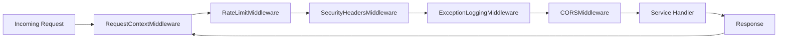

# MovieVerse Middleware

MovieVerse-Middleware provides production-ready middleware components shared across MovieVerse backend services (FastAPI and Django). It centralizes logging, CORS, rate limiting, security headers, and JWT verification.

## Request Flow



Notes:

- Rate limiting uses Redis and fails open if Redis is unavailable.
- `X-Request-ID` is generated or propagated for traceability.

## Package Layout

```
MovieVerse-Middleware/
├── movieverse_middleware/
│   ├── asgi.py               # FastAPI/Starlette middleware
│   ├── django.py             # Django middleware
│   ├── auth.py               # JWT verification helpers
│   ├── config.py             # Environment-driven settings
│   └── logging.py            # JSON logger
├── cors.py                   # Backward-compatible WSGI wrapper
├── middleware.py             # Backward-compatible Django wrappers
└── requirements.txt
```

## FastAPI Usage

```python
from fastapi import FastAPI
from movieverse_middleware.asgi import (
    CORSMiddleware,
    ExceptionLoggingMiddleware,
    RateLimitMiddleware,
    RequestContextMiddleware,
    SecurityHeadersMiddleware,
)

app = FastAPI()
app.add_middleware(RequestContextMiddleware)
app.add_middleware(RateLimitMiddleware)
app.add_middleware(SecurityHeadersMiddleware)
app.add_middleware(ExceptionLoggingMiddleware)
app.add_middleware(CORSMiddleware)
```

## Django Usage

Add middleware in `settings.py`:

```python
MIDDLEWARE = [
    "movieverse_middleware.django.RequestTimingMiddleware",
    "movieverse_middleware.django.URLBasedRateLimitingMiddleware",
    "movieverse_middleware.django.ContentSecurityPolicyMiddleware",
    "movieverse_middleware.django.ExceptionLoggingDjangoMiddleware",
    "movieverse_middleware.django.BlacklistingMiddleware",
]
```

## Environment Variables

All settings are driven by `MOVIEVERSE_` prefixed environment variables:

- `MOVIEVERSE_LOG_LEVEL`
- `MOVIEVERSE_CORS_ALLOW_ORIGINS`
- `MOVIEVERSE_CORS_ALLOW_METHODS`
- `MOVIEVERSE_CORS_ALLOW_HEADERS`
- `MOVIEVERSE_REDIS_URL`
- `MOVIEVERSE_RATE_LIMIT_MAX`
- `MOVIEVERSE_RATE_LIMIT_WINDOW_SEC`
- `MOVIEVERSE_JWT_SECRET`
- `MOVIEVERSE_CSP_DEFAULT_SRC`
- `MOVIEVERSE_CSP_IMG_SRC`
- `MOVIEVERSE_CSP_SCRIPT_SRC`

## Compatibility Files

- `cors.py`: WSGI CORS wrapper for legacy Flask usage.
- `middleware.py`: legacy Django middleware module updated to call the new package.
