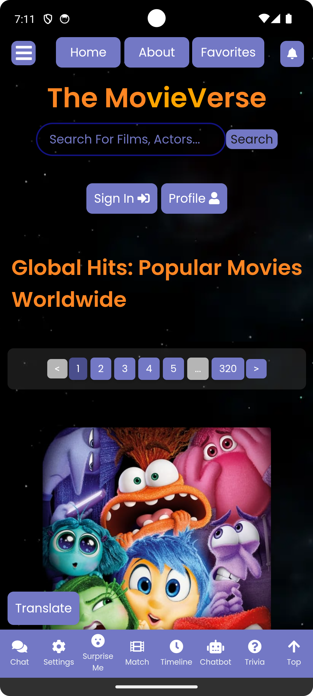

# The MovieVerse - `MovieVerse-Mobile` Directory

## Table of Contents
- [Overview](#overview)
- [User Interface (iOS)](#user-interface-ios)
- [User Interface (Android)](#user-interface-android)
- [Features](#features)
  - [Easy Navigation](#easy-navigation)
  - [Rich Movie Catalog](#rich-movie-catalog)
  - [Interactive Elements](#interactive-elements)
  - [And all other features from the web app!](#and-all-other-features-from-the-web-app)
  - [Launch Screen](#launch-screen)
- [Development](#development)
  - [Prerequisites](#prerequisites)
  - [Instructions](#instructions)
  - [Special Notes](#special-notes)
- [Usage](#usage)
  - [Browsing Movies](#browsing-movies)
  - [Searching for Movies](#searching-for-movies)
  - [Viewing Movie Details](#viewing-movie-details)
  - [Adding to Favorites](#adding-to-favorites)
  - [Accessing Favorites](#accessing-favorites)

## Overview

MovieVerse is a dynamic, user-friendly mobile application that offers an extensive library of movies across various genres. Designed for movie enthusiasts, it provides a seamless browsing experience on iOS devices, including iPhones and iPads. Explore popular, award-winning, and hidden gems, or dive into categories like action, horror, romance, and more. MovieVerse is your ultimate mobile destination for movie discovery and entertainment.

**Note:** The app is under active development and will be available for download on the App Store and Google Play Store soon. Stay tuned for updates!

## User Interface (iOS)

<p align="center" style="cursor: pointer">
  <a href="https://movie-verse.com">
    
  </a>
</p>

## User Interface (Android)

<p align="center" style="cursor: pointer">
  <a href="https://movie-verse.com">
    
  </a>
</p>

## Features

### Easy Navigation
- **Side Navigation Bar**: Swipe or tap to access different movie categories and features.
- **Search Functionality**: Search for your favorite movies or explore new ones with ease.
- **Back to Top Button**: Quickly return to the top of the page with a single tap.

### Rich Movie Catalog
- **Multiple Genres**: Access movies sorted by genres like action, horror, documentary, and more.
- **Director's Spotlight**: Discover movies by renowned directors in the special spotlight section.
- **Movie of the Day**: Get daily recommendations for the top-rated movie of the day.

### Interactive Elements
- **Favorites**: Add movies to your favorites list for quick access.
- **Movie Details**: Tap on any movie to view detailed information, including ratings, overviews, and more.
- **Responsive Design**: Enjoy a consistent and engaging user experience on both iPhones and iPads.

### And all other features from the web app!

### Launch Screen

MovieVerse also offers a launch screen that welcomes users with a sleek and engaging design. The launch screen is designed to provide a seamless transition to the main app interface, ensuring a visually appealing experience from the moment the app is launched.

<p align="center" style="cursor: pointer">
  <a href="https://movie-verse.com">
    
  </a>
</p>

The launch screen will be displayed when the app is launched, providing a brief introduction to the app's theme and design before transitioning to the main interface. It stay for roughly 2-3 seconds before transitioning to the main app interface.

## Development

### Prerequisites
- [Xcode](https://developer.apple.com/xcode/) 12.5 or later
- [CocoaPods](https://cocoapods.org/) 1.10.1 or later
- [Android Studio](https://developer.android.com/studio) 4.2.1 or later
- [Android SDK](https://developer.android.com/studio#downloads) 30.0.3 or later
- [Apache Cordova](https://cordova.apache.org/) 10.0.0 or later
- [Node.js](https://nodejs.org/en/) 14.17.0 or later
- [npm](https://www.npmjs.com/) 6.14.13 or later
- [Swift](https://developer.apple.com/swift/) 5.4.2 or later
- [Java](https://www.oracle.com/java/technologies/javase-jdk11-downloads.html) 11.0.11 or later
- [Gradle](https://gradle.org/) 7.0.2 or later
- [Git](https://git-scm.com/) 2.32.0 or later

### Instructions
1. **Clone the Repository**: Clone the repository to your local machine using the following command:
    ```bash
    git clone
    ```
2. **Install Dependencies**: Navigate to the project directory and install the dependencies using the following command:
    ```bash
    npm install
    ```
3. **Add iOS Platform**: Add the iOS platform to the project using the following command:
    ```bash
    cordova platform add ios
    ```
4. **Add Android Platform**: Add the Android platform to the project using the following command:
    ```bash
    cordova platform add android
    ```
5. **Build the Project**: Build the project using the following command:
    ```bash
    cordova build ios
    cordova build android
    ```
6. **Run the Project**: Run the project using the following command:
    ```bash
    cordova emulate ios
    cordova emulate android
    ```
7. **Open the Project**: Open the project in Xcode and/or Android Studio to view the source code and test the app within the simulator.
8. **Enjoy coding!**

### Special Notes

**Important**: If you make any changes to the source code of the **iOS** mobile app, you will need to update the iOS build process by removing iOS and adding it again using the following commands:

```bash
cordova platform rm ios
cordova platform add ios
```

Then, go to Xcode and re-build & re-run the app.

The **Android** app, however, will build and run automatically as expected without any additional steps. You will just have to re-build and re-run the app:

```bash
cordova build android
cordova emulate android
```

## Usage

### Browsing Movies
- Scroll through various categories on the home screen.
- Tap on any genre title to explore movies within that genre.

### Searching for Movies
- Tap on the search bar at the top.
- Enter the movie name and tap the search icon.

### Viewing Movie Details
- Tap on any movie poster to view detailed information.
- In the movie details page, you can read the synopsis, check ratings, and more.

### Adding to Favorites
- While viewing movie details, tap on the "Add to Favorites" button to add the movie to your favorites list.

### Accessing Favorites
- Tap on the "Favorites" button in the navigation bar to view your list of favorite movies.

## Support

For support, feedback, or inquiries, please email us at [info@movie-verse.com](mailto:info@movie-verse.com).

## Updates and Feedback

Stay updated with the latest version of the app for new features and improvements. Your feedback is valuable to us, so don't hesitate to share your thoughts and suggestions.

Enjoy exploring the world of movies with MovieVerse on your mobile device!

---
