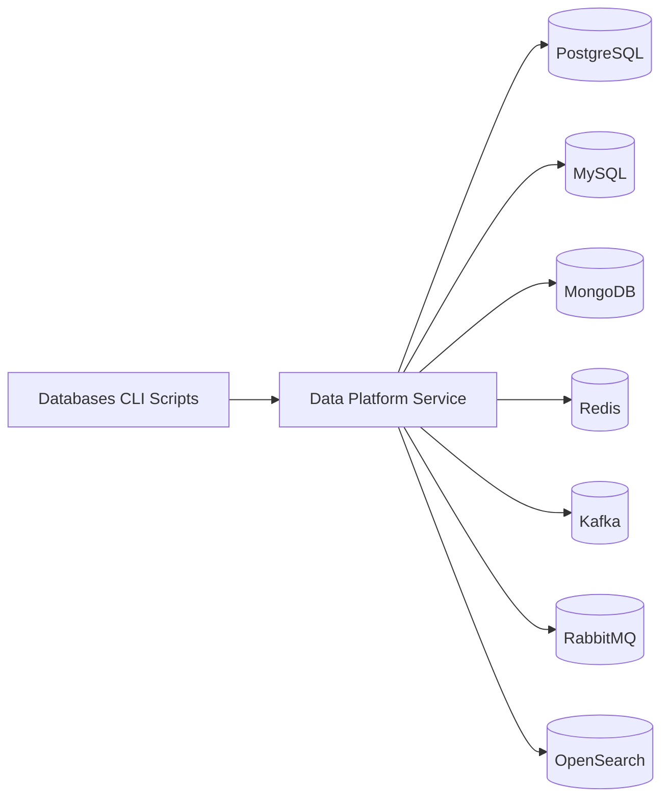
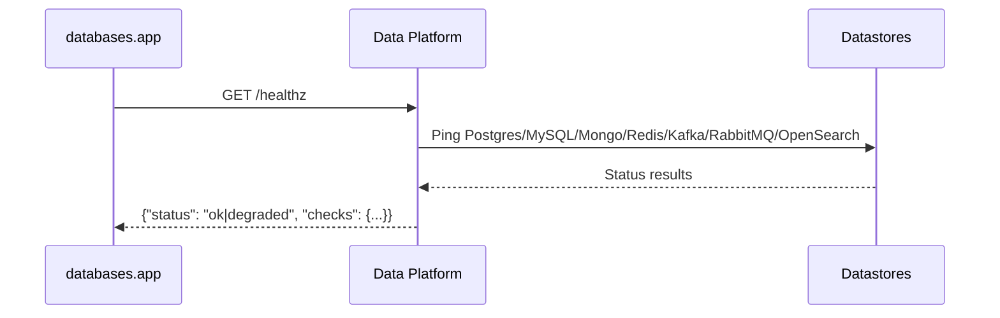

# MovieVerse Databases Utilities

This directory contains production-ready Python utilities for database health checks, TMDB ingestion,
controlled seeding, and RabbitMQ publishing. These utilities call the **Data Platform Service** and
are also imported by backend services for standardized health checks.

## What Lives Here

- `config.py`: Environment configuration loader shared by CLI utilities.
- `client.py`: HTTP client for the data platform API.
- `health.py`: Database connectivity checks (Postgres, MySQL, Mongo, Redis, Kafka, RabbitMQ, OpenSearch).
- `operations.py`: Typed operations for ingestion, seeding, and publishing.
- `app.py`: CLI health check.
- `mongo_redis.py`: CLI for TMDB ingestion (movies/genres/people).
- `postgresql.py`: CLI for user seeding.
- `mysql.py`: CLI for review seeding.
- `publish.py`: CLI for RabbitMQ publishing.

## Architecture



Health check flow used by both CLI utilities and the data platform service:



## Environment Configuration

All scripts read the same `MOVIEVERSE_*` environment variables used by the microservices:

- `MOVIEVERSE_DATA_PLATFORM_URL`
- `MOVIEVERSE_SEED_TOKEN`
- `MOVIEVERSE_SEED_USER_PASSWORD`
- `MOVIEVERSE_POSTGRES_DSN`
- `MOVIEVERSE_MYSQL_DSN`
- `MOVIEVERSE_MONGO_URI`
- `MOVIEVERSE_REDIS_URL`
- `MOVIEVERSE_KAFKA_BOOTSTRAP_SERVERS`
- `MOVIEVERSE_RABBITMQ_URL`
- `MOVIEVERSE_OPENSEARCH_URL`

## Install Dependencies

```bash
python -m venv venv
source venv/bin/activate
pip install -r MovieVerse-Backend/databases/requirements.txt
```

## Usage

Health check:

```bash
python -m databases.app
```

Ingest TMDB movies/genres/people:

```bash
python -m databases.mongo_redis --pages 5
```

Seed users (requires `MOVIEVERSE_ALLOW_SEEDING=true` and `MOVIEVERSE_SEED_TOKEN`):

```bash
python -m databases.postgresql --count 50 --password "$MOVIEVERSE_SEED_USER_PASSWORD"
```

Seed reviews:

```bash
python -m databases.mysql --count 100 --min-rating 1 --max-rating 5
```

Publish a RabbitMQ message:

```bash
python -m databases.publish --message "Hello from MovieVerse"
```

## Production Notes

- Seeding is disabled by default in production. Enable it explicitly with:
  `MOVIEVERSE_ALLOW_SEEDING=true` and a strong `MOVIEVERSE_SEED_TOKEN`.
- These scripts are safe for automation, but should be executed in controlled environments only.
- The data platform service uses `databases.health` for standardized connectivity checks.

## Relationship to the Backend

- **Data Platform Service** imports `databases.health` for health checks.
- The CLI utilities provide operational access to ingestion and seeding that the backend already supports
  through the `/ingest/*` and `/seed/*` APIs.

