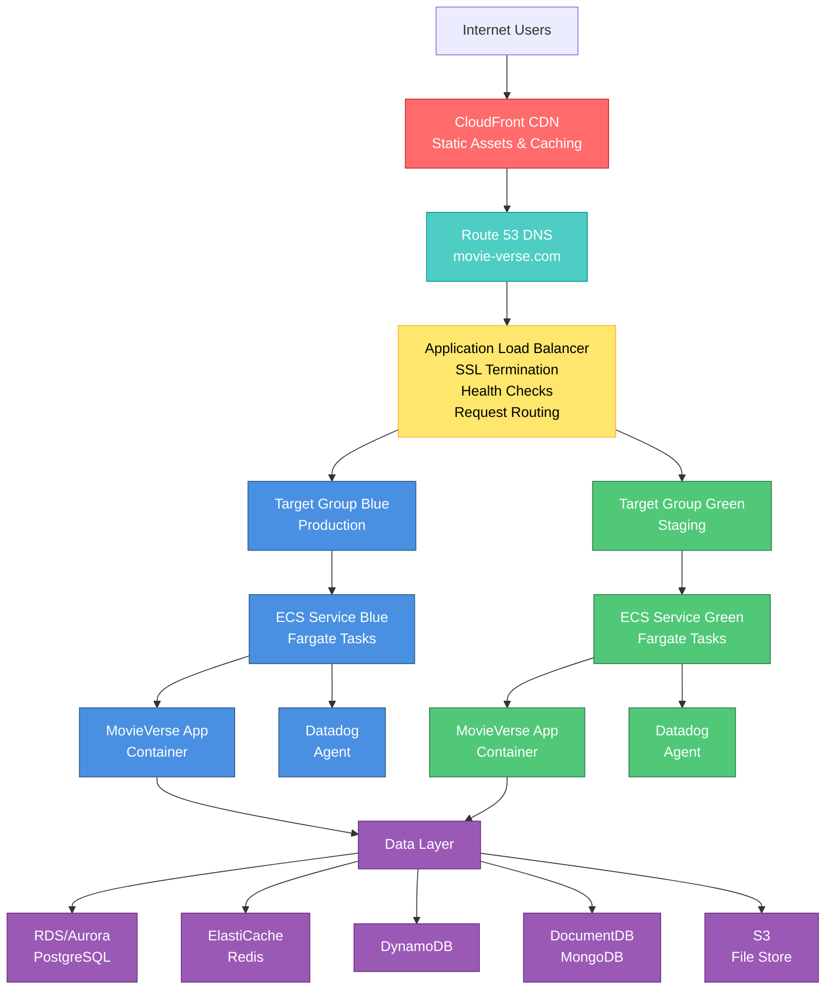
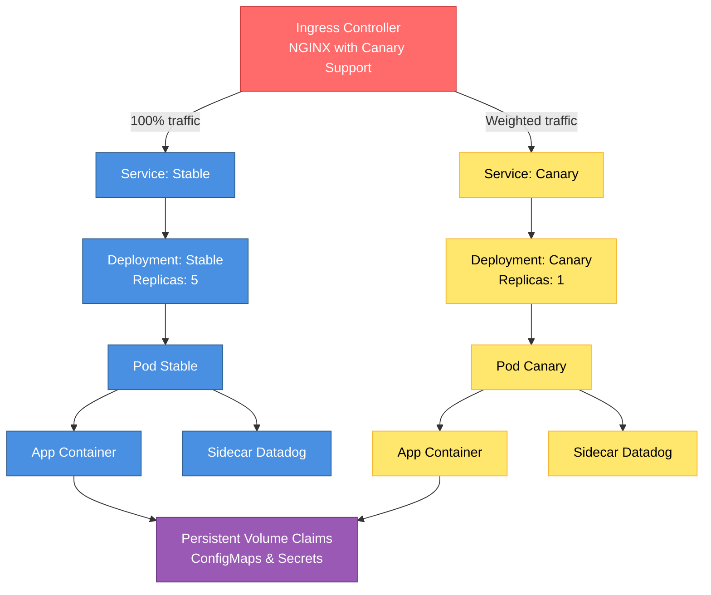
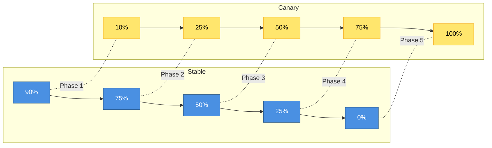
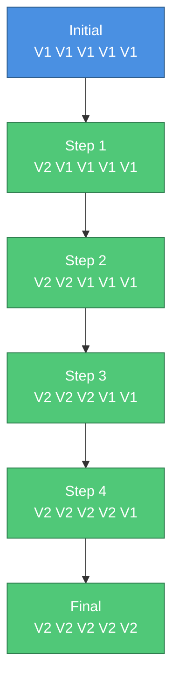

# MovieVerse Deployment Architecture

## Overview

This document describes the production deployment architecture for MovieVerse, including infrastructure components, deployment strategies, and operational considerations.

## Architecture Diagram

### High-Level Architecture



### Kubernetes Architecture (Alternative)



## Infrastructure Components

### Networking

#### VPC Configuration
- **CIDR Block**: 10.0.0.0/16
- **Availability Zones**: 2 (us-east-1a, us-east-1b)
- **Public Subnets**: 10.0.1.0/24, 10.0.2.0/24
- **Private Subnets**: 10.0.11.0/24, 10.0.12.0/24
- **NAT Gateways**: 2 (one per AZ)
- **Internet Gateway**: 1

#### Load Balancing
- **Type**: Application Load Balancer (ALB)
- **Scheme**: Internet-facing
- **Cross-Zone Load Balancing**: Enabled
- **Health Check**: HTTP /health endpoint
- **SSL/TLS**: ACM certificate with automatic renewal

### Compute

#### ECS Fargate Configuration
```yaml
Task Definition:
  CPU: 512 (0.5 vCPU)
  Memory: 1024 MB (1 GB)
  Network Mode: awsvpc

Containers:
  - Name: movieverse-app
    Image: ECR Repository
    Port: 5000
    Environment: Production

  - Name: datadog-agent
    Image: Datadog Agent
    Essential: false
```

#### Auto-Scaling Configuration
```yaml
Auto-Scaling:
  Min Capacity: 2
  Max Capacity: 10
  Target CPU: 70%
  Target Memory: 80%
  Scale-in Cooldown: 300s
  Scale-out Cooldown: 60s
```

### Data Layer

#### Databases
- **PostgreSQL (RDS Aurora)**: Primary relational database
- **MongoDB (DocumentDB)**: Document storage
- **Redis (ElastiCache)**: Caching and session storage
- **MySQL (RDS)**: Legacy data

#### Storage
- **S3**: Static assets, backups, logs
- **EFS**: Shared file storage (if needed)

### Monitoring Stack

#### Prometheus
- **Purpose**: Metrics collection and alerting
- **Retention**: 15 days
- **Scrape Interval**: 15 seconds
- **Storage**: EBS volumes with snapshots

#### Datadog
- **APM**: Application performance monitoring
- **Logs**: Centralized log aggregation
- **Metrics**: Custom application metrics
- **Traces**: Distributed tracing

#### CloudWatch
- **Logs**: Container logs, application logs
- **Metrics**: Infrastructure metrics
- **Alarms**: Automated alerting
- **Dashboards**: Operational dashboards

## Deployment Strategies

### Blue-Green Deployment

#### Architecture

```mermaid
flowchart TB
    ALB[Application Load Balancer]

    ALB -->|"Production traffic"| TG_Blue[Target Group Blue<br/>(Production)]
    ALB -->|"Test traffic (port 8080)"| TG_Green[Target Group Green<br/>(Staging)]

    TG_Blue --> Blue_Services[Blue Services]
    TG_Green --> Green_Services[Green Services]

    TG_Blue <-->|Active switch| TG_Green

    classDef blue fill:#4A90E2,stroke:#2E5C8A,color:#fff
    classDef green fill:#50C878,stroke:#2E7D4E,color:#fff
    class TG_Blue,Blue_Services blue
    class TG_Green,Green_Services green
```

#### Benefits
- **Zero Downtime**: Traffic switches instantly
- **Quick Rollback**: Switch back to previous environment
- **Full Testing**: Test complete environment before switch
- **Identical Environments**: Production parity

#### Drawbacks
- **Resource Cost**: Requires 2x infrastructure
- **Database Migrations**: Need to be backward compatible
- **Complexity**: Managing two complete environments

### Canary Deployment

#### Traffic Distribution



#### Automated Progression
```yaml
Analysis:
  Initial Delay: 1 minute
  Interval: 1 minute
  Threshold: 5 failures
  Max Weight: 50%
  Step Weight: 10%

Metrics:
  - Success Rate: > 99%
  - P99 Latency: < 500ms
  - Error Rate: < 1%
```

#### Benefits
- **Risk Mitigation**: Limited blast radius
- **Real Traffic Testing**: Actual production load
- **Automated Monitoring**: Auto rollback on issues
- **Gradual Rollout**: Progressive deployment

#### Drawbacks
- **Longer Deployment Time**: Gradual rollout takes time
- **Complexity**: Requires sophisticated monitoring
- **State Management**: Need to handle mixed versions

### Rolling Deployment

#### Process



#### Configuration
```yaml
Deployment:
  Max Surge: 1 (25%)
  Max Unavailable: 0 (0%)
  Progress Deadline: 600s
  Revision History Limit: 10
```

#### Benefits
- **Resource Efficient**: No duplicate infrastructure
- **Simple**: Easiest to implement
- **Built-in**: Native ECS/K8s support

#### Drawbacks
- **Mixed Versions**: Old and new running simultaneously
- **Gradual Issues**: Problems may not be immediately obvious
- **Database Migrations**: Must be backward compatible

## Security Architecture

### Network Security

```mermaid
flowchart TB
    Internet[Internet (0.0.0.0/0)]
    ALB_SG[ALB Security Group<br/>Inbound: 80, 443 from Internet]
    ECS_SG[ECS Tasks Security Group<br/>Inbound: 5000 from ALB SG]
    DB_SG[Database Security Group<br/>Inbound: 3306, 5432, 6379, 27017 from ECS SG]

    Internet -->|"Ports 80/443"| ALB_SG -->|"Port 5000"| ECS_SG -->|"DB ports"| DB_SG
```

### IAM Roles

#### Task Execution Role
- ECR image pull
- CloudWatch Logs write
- Secrets Manager read

#### Task Role
- DynamoDB access
- S3 read/write
- CloudWatch metrics write

#### Service Account (Kubernetes)
- ConfigMap/Secret read
- Pod read
- Service read

### Secrets Management

```yaml
AWS Secrets Manager:
  - Database credentials
  - API keys
  - JWT secrets

Environment Variables:
  - Non-sensitive configuration
  - Feature flags
  - Service endpoints

ConfigMaps (K8s):
  - Application configuration
  - Service discovery
```

## Disaster Recovery

### Backup Strategy

```yaml
Database Backups:
  RDS Aurora:
    Automated: Daily at 3 AM UTC
    Retention: 30 days
    Cross-Region: Enabled (us-west-2)

  DocumentDB:
    Automated: Daily
    Retention: 7 days

  ElastiCache:
    Snapshots: Daily
    Retention: 7 days

Application Backups:
  ECS Task Definitions: Version controlled
  Kubernetes Manifests: Git repository
  Infrastructure: CloudFormation templates
```

### Recovery Objectives

- **RTO (Recovery Time Objective)**: 1 hour
- **RPO (Recovery Point Objective)**: 15 minutes

### DR Procedures

1. **Database Restoration**: 15-20 minutes
2. **Application Deployment**: 10-15 minutes
3. **DNS Propagation**: 5-10 minutes
4. **Verification**: 10-15 minutes

**Total Recovery Time**: ~45-60 minutes

## Cost Optimization

### Monthly Cost Breakdown (Estimated)

```
ECS Fargate (Production):
  - Tasks (avg 5): $75/month
  - Data Transfer: $20/month

Load Balancer:
  - ALB: $25/month
  - Data Processing: $15/month

Databases:
  - RDS Aurora: $150/month
  - DocumentDB: $100/month
  - ElastiCache: $50/month

Monitoring:
  - CloudWatch: $30/month
  - Datadog: $100/month

Storage:
  - S3: $20/month
  - EBS: $15/month

Total: ~$600/month
```

### Optimization Strategies

1. **Right-sizing**: Monitor and adjust instance sizes
2. **Spot Instances**: Use for non-production environments
3. **Reserved Capacity**: 1-year commitments for databases
4. **Auto-Scaling**: Scale down during off-peak hours
5. **S3 Lifecycle**: Move old data to cheaper storage classes

## Scalability

### Current Capacity
- **Requests per second**: 1,000
- **Concurrent users**: 10,000
- **Database connections**: 100

### Scaling Limits
- **ECS Tasks**: Up to 100 per service
- **ALB**: 500,000 requests/second
- **Database**: Aurora read replicas up to 15

### Bottlenecks
1. **Database**: Add read replicas
2. **Compute**: Increase task count or size
3. **Network**: Use CloudFront CDN
4. **Cache**: Scale ElastiCache cluster

## Future Enhancements

1. **Multi-Region Deployment**: Active-active across regions
2. **Service Mesh**: Implement Istio for advanced traffic management
3. **GitOps**: Implement ArgoCD/Flux for Kubernetes deployments
4. **Chaos Engineering**: Implement failure injection testing
5. **Cost Optimization**: FinOps practices and tools
