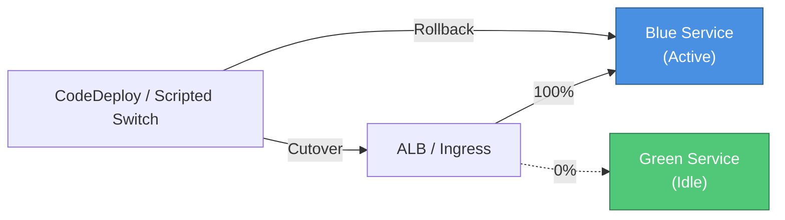
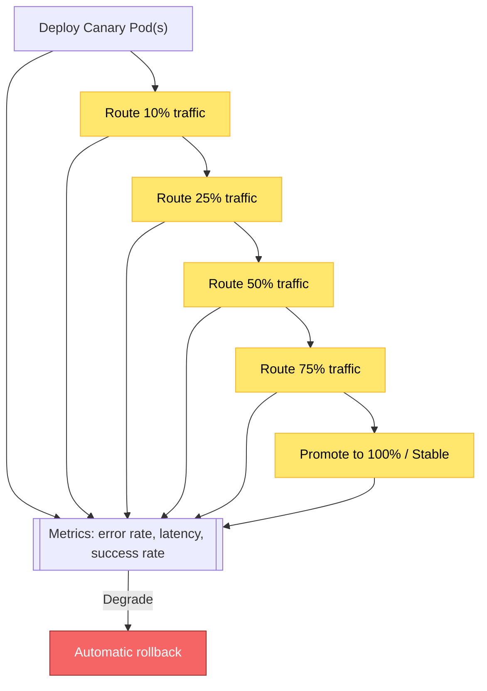
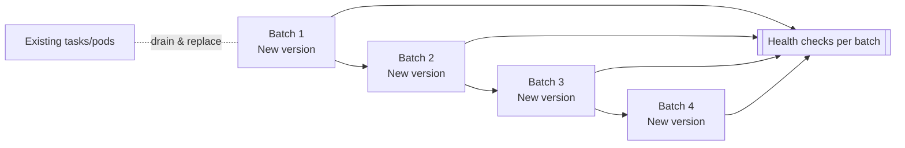
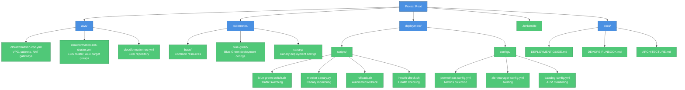
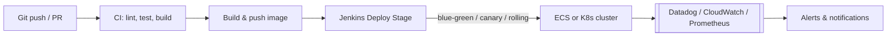

# MovieVerse - Deployment Infrastructure

## Overview

This project now includes production-ready deployment infrastructure supporting **Blue-Green**, **Canary**, and **Rolling** deployment strategies with comprehensive monitoring, automated rollback, and DevOps best practices.

## 🚀 What's New

### Deployment Strategies

#### 1. **Blue-Green Deployment**
- Zero-downtime deployments
- Instant rollback capability
- Full environment validation
- AWS ECS + CodeDeploy integration



#### 2. **Canary Deployment**
- Progressive traffic shifting (10% → 25% → 50% → 75% → 100%)
- Automated metrics monitoring
- Auto-rollback on degraded performance
- Kubernetes + Flagger support



#### 3. **Rolling Deployment**
- Resource-efficient updates
- Gradual instance replacement
- Native ECS/Kubernetes support



### Infrastructure Components



### CI/CD Pipeline Flow



## 📋 Prerequisites

### Required Tools
- AWS CLI v2.x
- Docker 20.x+
- kubectl 1.28+ (for Kubernetes deployments)
- Jenkins 2.x
- Python 3.9+

### AWS Setup

1. **Configure AWS credentials:**
   ```bash
   aws configure
   ```

2. **Set environment variables:**
   ```bash
   export AWS_REGION=us-east-1
   export AWS_ACCOUNT_ID=$(aws sts get-caller-identity --query Account --output text)
   ```

## 🏗️ Infrastructure Setup

### Option 1: AWS ECS (Fargate)

1. **Deploy VPC infrastructure:**
   ```bash
   aws cloudformation create-stack \
     --stack-name movieverse-vpc \
     --template-body file://aws/cloudformation-vpc.yml \
     --parameters ParameterKey=EnvironmentName,ParameterValue=movieverse-prod
   ```

2. **Create ECR repository:**
   ```bash
   aws cloudformation create-stack \
     --stack-name movieverse-ecr \
     --template-body file://aws/cloudformation-ecr.yml
   ```

3. **Deploy ECS cluster:**
   ```bash
   aws cloudformation create-stack \
     --stack-name movieverse-ecs \
     --template-body file://aws/cloudformation-ecs-cluster.yml \
     --capabilities CAPABILITY_NAMED_IAM
   ```

### Option 2: Kubernetes (EKS/GKE/AKS)

Use the consolidated Kubernetes stack in `kubernetes/` for both the core microservices and rollout patterns.

1. **Apply microservices base resources:**
   ```bash
   kubectl apply -f kubernetes/base/
   kubectl apply -f kubernetes/infra/
   kubectl apply -f kubernetes/services/
   kubectl apply -f kubernetes/edge/
   ```

2. **Apply legacy blue-green base resources (optional):**
   ```bash
   kubectl apply -f kubernetes/base/
   ```

3. **Deploy using Blue-Green strategy:**
   ```bash
   kubectl apply -f kubernetes/blue-green/
   ```

4. **Or deploy using Canary strategy:**
   ```bash
   kubectl apply -f kubernetes/canary/
   ```

## 🔄 Deployment

### Using Jenkins Pipeline

1. **Trigger deployment:**
   ```bash
   # Via Jenkins UI: Build with Parameters
   # Select:
   # - DEPLOYMENT_STRATEGY: blue-green / canary / rolling
   # - ENVIRONMENT: production / staging
   # - IMAGE_TAG: v1.0.0
   ```

2. **Or use API:**
   ```bash
   curl -X POST http://jenkins.company.com/job/movieverse-deploy/buildWithParameters \
     -d "DEPLOYMENT_STRATEGY=blue-green" \
     -d "ENVIRONMENT=production" \
     -d "IMAGE_TAG=v2.0.0"
   ```

### Manual Deployment

#### Blue-Green Deployment

```bash
# 1. Deploy to green environment
aws ecs update-service \
  --cluster movieverse-prod-cluster \
  --service movieverse-prod-service-green \
  --force-new-deployment

# 2. Wait for deployment to stabilize
aws ecs wait services-stable \
  --cluster movieverse-prod-cluster \
  --services movieverse-prod-service-green

# 3. Run health checks
./deployment/scripts/health-check.sh \
  --url https://green.movie-verse.com \
  --type comprehensive

# 4. Switch traffic
./deployment/scripts/blue-green-switch.sh --target green
```

#### Canary Deployment

```bash
# 1. Update canary deployment
kubectl set image deployment/movieverse-canary \
  movieverse-app=123456789.dkr.ecr.us-east-1.amazonaws.com/movieverse:v2.0.0 \
  -n movieverse

# 2. Monitor canary metrics
python3 deployment/scripts/monitor-canary.py \
  --duration 300 \
  --error-threshold 5 \
  --latency-threshold 500

# 3. If healthy, promote to stable
kubectl set image deployment/movieverse-stable \
  movieverse-app=123456789.dkr.ecr.us-east-1.amazonaws.com/movieverse:v2.0.0 \
  -n movieverse
```

## 📊 Monitoring

### Prometheus

Access metrics:
```bash
# Port-forward Prometheus
kubectl port-forward -n monitoring svc/prometheus 9090:9090

# Open http://localhost:9090
```

### Datadog

- **APM**: Application traces and performance
- **Logs**: Centralized log aggregation
- **Metrics**: Custom application metrics
- **Alerts**: Real-time alerting

### CloudWatch

```bash
# View logs
aws logs tail /ecs/movieverse-prod --follow

# View metrics dashboard
aws cloudwatch get-dashboard --dashboard-name MovieVerse-Production
```

## 🔙 Rollback

### Automatic Rollback

- Triggered automatically on health check failures
- Triggered on high error rates during canary
- ECS circuit breaker enabled

### Manual Rollback

```bash
# Rollback blue-green
./deployment/scripts/rollback.sh --strategy blue-green

# Rollback canary
./deployment/scripts/rollback.sh --strategy canary

# Rollback rolling
./deployment/scripts/rollback.sh --strategy ecs-rolling
```

## 🔍 Health Checks

```bash
# Basic HTTP check
./deployment/scripts/health-check.sh \
  --url https://movie-verse.com \
  --type http

# Comprehensive check (HTTP + API + databases + SSL)
./deployment/scripts/health-check.sh \
  --url https://movie-verse.com \
  --type comprehensive
```

## 📚 Documentation

Comprehensive documentation available in `/docs`:

- **[DEPLOYMENT-GUIDE.md](docs/DEPLOYMENT-GUIDE.md)**: Complete deployment guide with step-by-step instructions
- **[DEVOPS-RUNBOOK.md](docs/DEVOPS-RUNBOOK.md)**: Operational procedures and troubleshooting
- **[ARCHITECTURE.md](docs/ARCHITECTURE.md)**: System architecture and design decisions

## 🛠️ Configuration

### Environment Variables

```bash
# AWS Configuration
export AWS_REGION=us-east-1
export AWS_ACCOUNT_ID=123456789012

# ECS Configuration
export ECS_CLUSTER=movieverse-prod-cluster

# Kubernetes Configuration
export K8S_NAMESPACE=movieverse

# Monitoring (Optional)
export DATADOG_API_KEY=your-key
export SLACK_WEBHOOK_URL=your-webhook
```

### Secrets Management

Secrets are stored in:
- **AWS Secrets Manager** (for ECS deployments)
- **Kubernetes Secrets** (for K8s deployments)
- **External Secrets Operator** (recommended for K8s)

## 🔐 Security

- **Network isolation**: Private subnets for application tier
- **Secrets encryption**: AWS Secrets Manager / K8s Secrets
- **Container scanning**: Trivy security scans in pipeline
- **IAM roles**: Least privilege access
- **Security groups**: Restricted ingress/egress rules

## 📈 Scaling

### Auto-Scaling Configuration

- **Min instances**: 2
- **Max instances**: 10
- **CPU target**: 70%
- **Memory target**: 80%
- **Scale-in cooldown**: 5 minutes
- **Scale-out cooldown**: 1 minute

### Manual Scaling

```bash
# ECS
aws ecs update-service \
  --cluster movieverse-prod-cluster \
  --service movieverse-prod-service-blue \
  --desired-count 10

# Kubernetes
kubectl scale deployment movieverse-stable --replicas=10 -n movieverse
```

## 🚨 Troubleshooting

### Deployment Issues

1. **Check service status:**
   ```bash
   aws ecs describe-services \
     --cluster movieverse-prod-cluster \
     --services movieverse-prod-service-blue
   ```

2. **View logs:**
   ```bash
   aws logs tail /ecs/movieverse-prod --follow
   ```

3. **Check health:**
   ```bash
   ./deployment/scripts/health-check.sh --url https://movie-verse.com
   ```

### Common Issues

| Issue | Solution |
|-------|----------|
| Permission denied on scripts | `chmod +x deployment/scripts/*.sh` |
| AWS authentication failed | `aws configure` or set credentials |
| Health check timeout | Increase `TIMEOUT` environment variable |
| Canary rollback | Check Prometheus alerts and error logs |

## 💰 Cost Optimization

Estimated monthly cost: **~$600**

- ECS Fargate: $75
- Load Balancer: $40
- Databases: $300
- Monitoring: $130
- Storage: $35
- Data Transfer: $20

## 🤝 Contributing

1. Test changes in staging environment
2. Update documentation
3. Follow deployment best practices
4. Run health checks before merging

## 📞 Support

- **Slack**: #movieverse-deployments
- **Email**: devops@movie-verse.com
- **PagerDuty**: On-call rotation
- **Documentation**: `/docs` directory

## 📄 License

See LICENSE.md

---

**Built with ❤️ by the MovieVerse DevOps Team**
