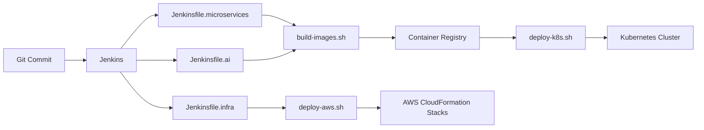

# MovieVerse Jenkins Pipelines

This directory contains Jenkins pipelines and scripts used to build, publish, and deploy the MovieVerse microservices and AI platform.

## Pipeline Overview

## Pipelines

- `Jenkinsfile.microservices`: Builds and pushes all backend services + AI API image, optional Kubernetes deploy.
- `Jenkinsfile.ai`: Builds and pushes the AI API image.
- `Jenkinsfile.infra`: Deploys AWS infrastructure stacks with CloudFormation.

## Scripts

- `scripts/build-images.sh`: Builds/pushes backend and AI images.
- `scripts/deploy-k8s.sh`: Applies Kubernetes manifests for core + AI services.
- `scripts/deploy-aws.sh`: Deploys VPC, ECR, RDS, ElastiCache, MSK, MQ, OpenSearch, and EKS.

## Jenkins Credentials

- `aws-credentials`: AWS access key/secret for ECR + CloudFormation
- `kubeconfig`: kubeconfig file credential for deployments

## Notes

- Update `AWS_REGION`, `ENV_NAME`, and registry variables in Jenkinsfiles as needed.
- Use a Jenkins agent with Docker and AWS CLI installed.
