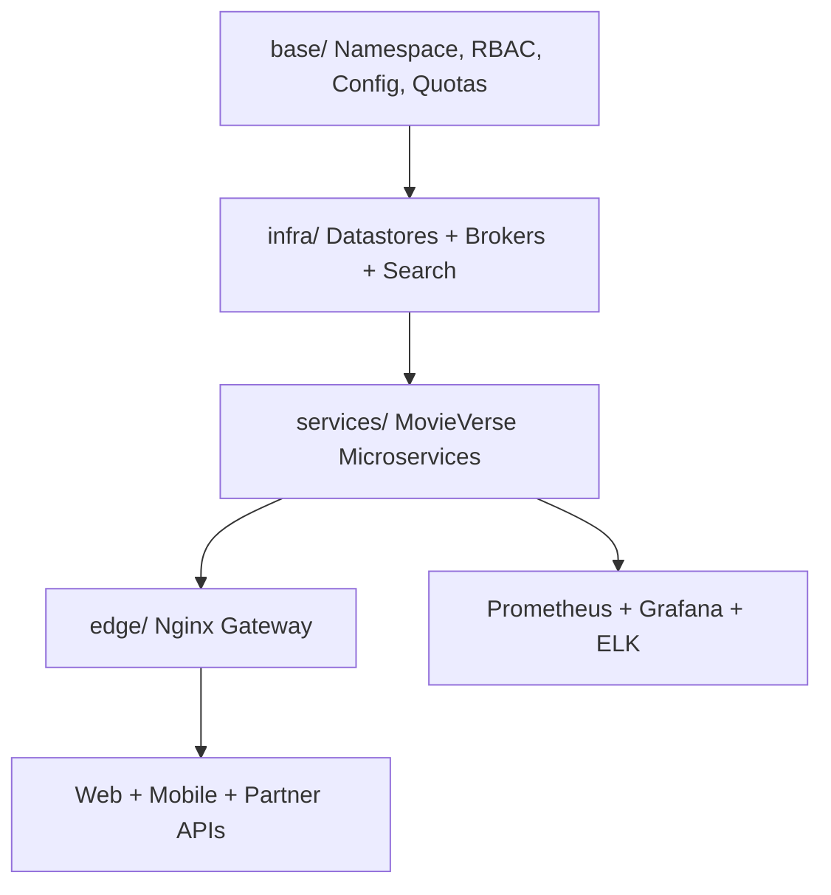

# MovieVerse Kubernetes Stack

This directory provides Kubernetes manifests for MovieVerse microservices, infrastructure dependencies, and the Nginx edge.

## Architecture



## Apply Order

```bash
kubectl apply -f kubernetes/base/
kubectl apply -f kubernetes/infra/
kubectl apply -f kubernetes/services/
kubectl apply -f kubernetes/edge/
```

## Notes

- Update `kubernetes/base/configmap.yml` and `kubernetes/base/secrets.yml` for production credentials.
- Use `MovieVerse-AI/k8s/` to deploy the AI platform and training cronjobs.
